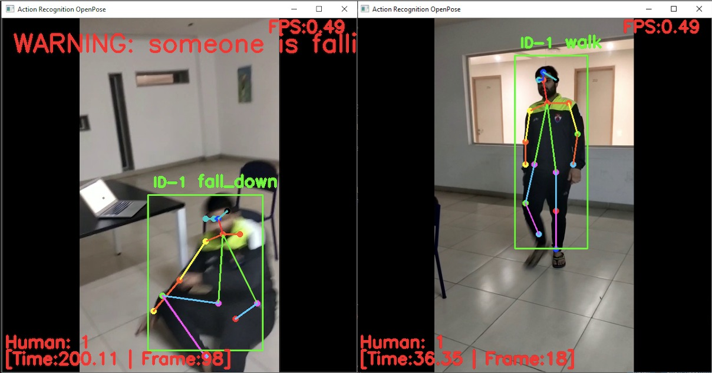

# action_recognition

## Problem Statement
Projects related to activity recognition is already been made but none have been implemented on real time basis. There are many applications where it can be used for example it can be used in hospital – at night if a patient falls from bed, nurse can be informed immediately and if there is a fight or any harmful activities will be recognized and displayed. It will also be recognized normal activities like wave, walking. It will also able to separate different activities in a frame and then label them so that multiple activities can be recognized at a time. Perceiving human action from video groupings or still pictures is a difficult undertaking because of issues, for example, foundation mess, halfway impediment, changes in scale, perspective, lighting, and appearance. Numerous applications, including video reconnaissance frameworks, human-pc interaction, and apply autonomy for human conduct portrayal,require a different action recognition framework. In this work, we give an itemized survey of later and cutting edge inquire about advances in the field of human action classification.

## Introduction

The ongoing innovations in convolutional neural networks (CNNs) alongside the plenitude of image and video content over the web have introduced open doors for the analysis and classifications of image and video content using deep learning and neural system. We propose a human activity recognition system that collects information from devices like webcam or external camera and utilizes an artificial neural system for classification. The proposed framework is additionally upgraded utilizing area data. We think about a few activities, including both basic and day by day activities. Trial results show that different activities can be classified with a good accuracy.

## Working

We use [OpenPose](https://github.com/CMU-Perceptual-Computing-Lab/openpose); for pose Estimation and [Deepsort](https://github.com/nwojke/deep_sortv); for human tracking. We use Action recognition with DNN for each person based on pose estimated by OpenPose.

## Requirements

- Python 3.5 or greater
- OpenCv
- pathlab
- tensorflow and Keras

## Results

    
